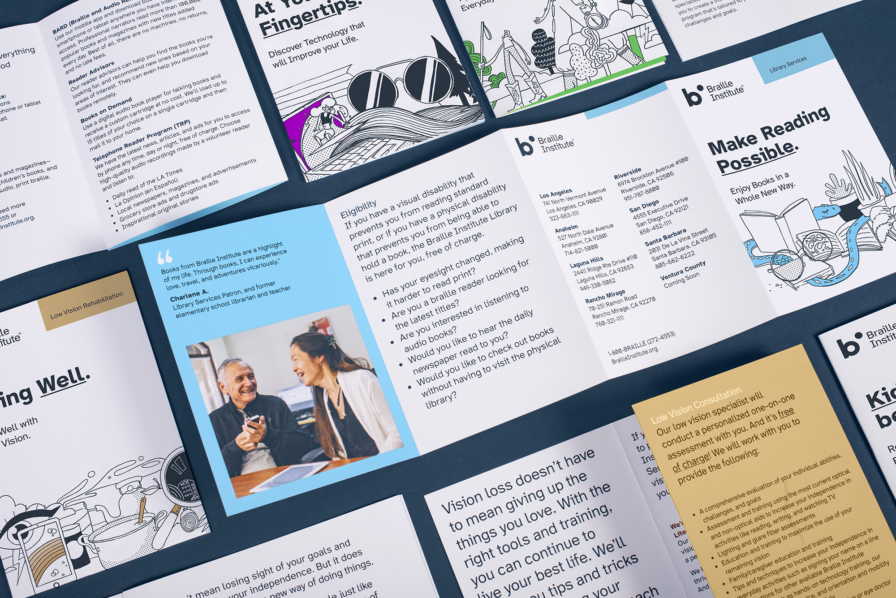

# Atkinson Hyperlegible Font Project

## Learn more at [brailleinstitute.org/freefont](https://brailleinstitute.org/freefont)

Atkinson Hyperlegible is a new typeface, offering greater legibility and readability for low vision readers. 
The font is named after Braille Institute founder, J. Robert Atkinson.
What makes it different from traditional typography design is that it focuses on letterform distinction to increase character recognition, ultimately improving readability.

The Braille Institute has made this free for anyone to use, under the SIL Open Font License.

The typeface was a Winner of Fast Company’s 2019 Innovation By Design Award.

* Four fonts, including two weights (regular, bold, italics, italics bold)
* 1,340 total glyphs across all fonts, 335 per font
* Accent characters supporting 27 languages
* For designers and anyone interested in making written materials easier to read across the entire visual-ability spectrum
* Improve legibility and readability for low vision readers

Informational sheet about Atkinson Hyperlegible font, with samples of informational brochures, business card, and more with text in the font: [Download Summary Document [.pdf]](docs/BIA_AtkinsonHyerlegible-Specimen_2020-02-10.pdf)

"Download the Font …and change the world!"

#### Instructions for Installing the Font

* Download the .zip file [from Github](https://github.com/googlefonts/atkinson-hyperlegible/archive/main.zip) (for now, and in future, from Google Fonts)
* Extract the file to reveal additional folders inside. Find the Open Type Format (.otf) files for the four Atkinson Hyperlegible fonts (regular, italic, bold, bold italic) inside the “fonts/otf” folder.
* Note that only the otf files are needed to install the font on a computer, and there are five additional font formats in the “Web Fonts” folder for use on the web.
* On Windows 10: Double-click the font file, then click the “Install” button in the font preview window that opens. The font will be installed. Alternatively, right-click on the file and choose “Install” from the pop-up menu that appears.
* On Mac: Double-click the font file in the Finder, then click “Install Font” in the font preview window that opens. After your Mac validates the font and opens the Font Book app, the font is installed and available for use.

## License

SIL Open Font License, v1.1. See [OFL.txt](OFL.txt) for details.

## Unique design features

For Low vision readers, certain letters and numbers can be hard to distinguish from one another.

Atkinson Hyperlegible differentiates common misinterpreted letters and numbers using various design techniques: B vs 8, 1 vs L vs l vs I.

Recognizable Footprints: Character boundaries clearly defined, ensuring understanding across the visual-ability spectrum.

Differentiated letterforms: Similar letter pairs are differentiated from each other to dramatically increase legibility.

> `Q vs G, E vs F, p vs q, i vs r, O vs 0`

Unambiguous Characters: designed to increase legibility and distinction

> `ER79jr Vsa36`

Exaggerated forms: Shaping of letters is exaggerated to provide better clarity

Opened Counterspace: Open areas of certain letters are expanded to provide greater distinction

> `aGbgrpqu Åö8ij%?¡,:`

Angled spurs and differentiated tails: Increase recognition and define distinctive style

Circular Details: Links to the history of Braille Institute and braille dots
